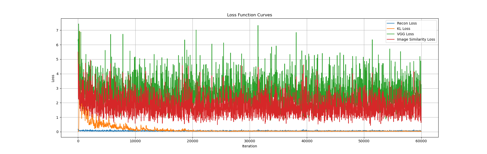
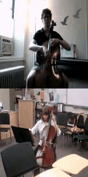
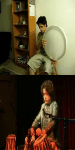

# 模型结构
## 1. 模型概述
该模型的核心结构为变分自编码器 (Variational Autoencoder, VAE)，旨在通过编码-解码框架对输入数据进行重构。模型由运动网络 (MotionNet)、编码器 (Encoder)、流解码器 (Flow Decoder) 以及可选的细化网络 (RefineNet) 组成，用于在时序数据（如视频帧）中生成连续的帧预测。此外，模型引入了VGG特征损失用于捕捉图像的高级特征信息，增强生成结果的视觉质量。

## 2. 模型的主要组件
### 2.1. MotionNet
MotionNet 是一个关键的子网络，负责生成编码后的潜在表示 mu 和 logvar，用于重构序列的运动特征。它接收多个输入帧（在本模型中为90个通道的输入），通过一系列卷积层和全连接层生成潜在分布的参数：

输入：尺寸为 (B, C, H, W) 的图像序列。
输出：两个大小为 (B, 1024) 的向量，分别代表 mu 和 logvar，用于VAE的重参数化。
### 2.2. Encoder
Encoder 是另一个关键子网络，用于提取输入图像的底层特征。该编码器由四个卷积层组成，每个卷积层后跟随激活函数（Leaky ReLU）和批归一化操作。最终的输出 codex 表示输入数据的潜在空间表示：

输入：尺寸为 (B, C, H, W) 的图像。
输出：四个特征图，分别为不同尺度的特征表示。
### 2.3. Flow Decoder
Flow Decoder 负责将编码后的潜在表示解码为流场（Flow Field），用于后续图像帧的生成和调整。该模块通过多个反卷积层和门控卷积层 (Gate Convolutional Layers) 实现解码操作，并将编码器的不同层级的特征与解码器进行跳跃连接 (Skip Connections)：

输入：编码器的多个特征图和潜在表示 z。
输出：多个解码后的特征图，表示生成的光流信息。
### 2.4. VGG Net (VGG19)
模型还包括一个预训练的VGG19网络 (vgg_net)，用于计算图像重建损失中的VGG特征损失。这部分网络的参数在训练中保持不变，通过提取高级语义特征来评估生成图像与真实图像的相似度。

输入：预处理后的图像（标准化）。
输出：VGG特征图。
### 2.5. RefineNet (可选)
RefineNet 是一个可选的模块，专用于对初始生成的图像进行细化处理，进一步提高图像的视觉质量和细节表现。通过与流场和遮罩进行组合，该模块输出更精确的图像帧预测。

输入：初始生成的图像帧和流场信息。
输出：细化后的高质量图像。
## 3. 前向传播流程
在前向传播过程中，模型首先通过 MotionNet 和 Encoder 生成潜在的运动表示和编码特征，随后通过 Flow Decoder 和 RefineNet 对图像进行解码和细化。在训练阶段，模型计算重构损失、KL散度损失、VGG损失等，进行反向传播以更新网络参数。

## 4. 损失函数
该模型采用了多种损失函数，包括：

重构损失 (Reconstruction Loss)
KL散度损失 (KL Divergence Loss)
VGG特征损失 (VGG Feature Loss)
图像相似性损失 (Image Similarity Loss)
这些损失函数共同作用，确保生成的图像具有较好的视觉质量和时序一致性。

# 损失曲线

# 部分效果
 真实视频
 生成视频   

